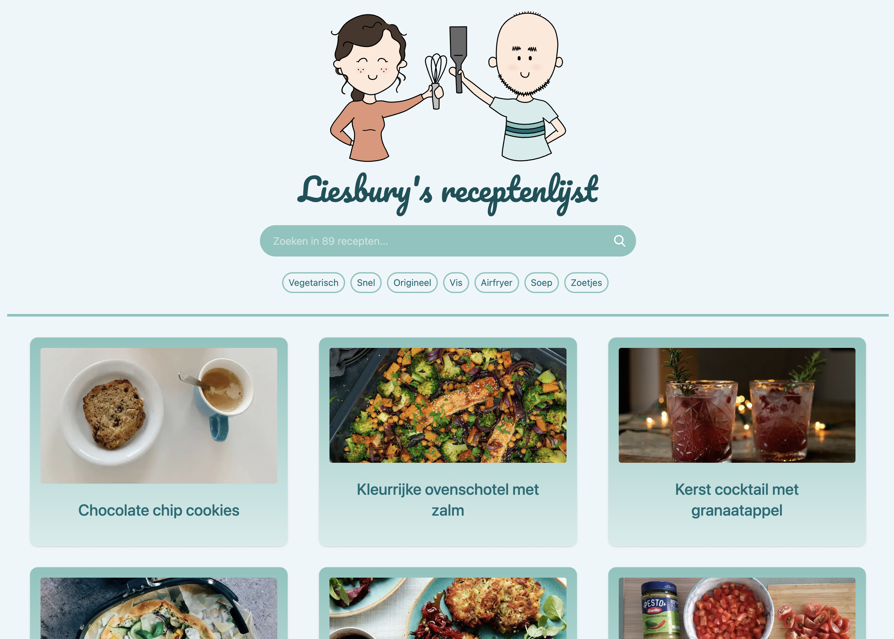
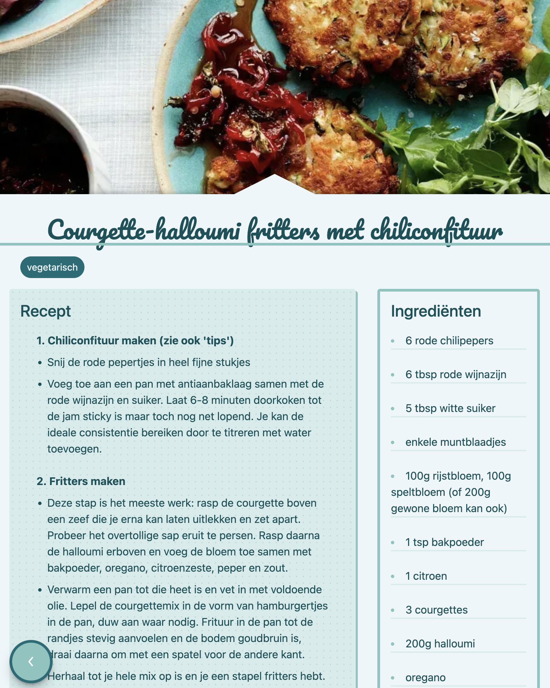
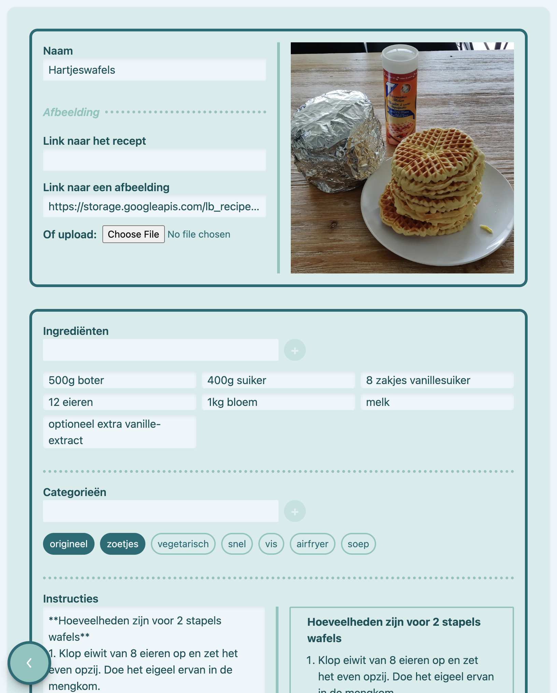

# Liesbury Recipes

Liesbury Recipes is a web application to store and share recipes.
It is meant for personal use, to help in creating meal plans and grocery lists.

It can be accessed at [recipes.lies.bury.dev](https://recipes.lies.bury.dev)

## Overview

- The homepage displays all stored and public recipes and allows searching recipes by name or filtering on tags

  

- The recipe page displays the recipe details

  

- Logged in users can create, edit and delete recipes.
  It provides a Markdown editor to write the recipe, and a form to fill in the recipe details.
  The recipe image can be uploaded manually or scraped from a provided recipe source URL.

  

## Stack

- The frontend is built with NextJS and hosted on Vercel
- The backend is built in a [separate repo](https://github.com/Tom-Bury/lb-recipes-backend), with NextJS and hosted on the Google Cloud.
